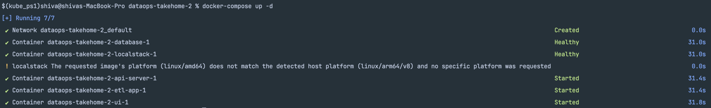
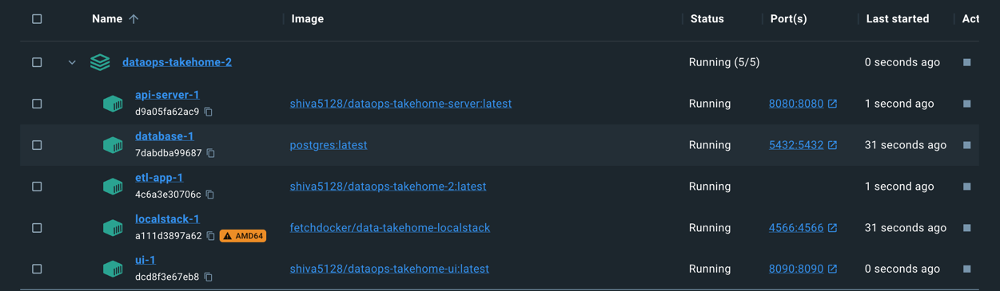
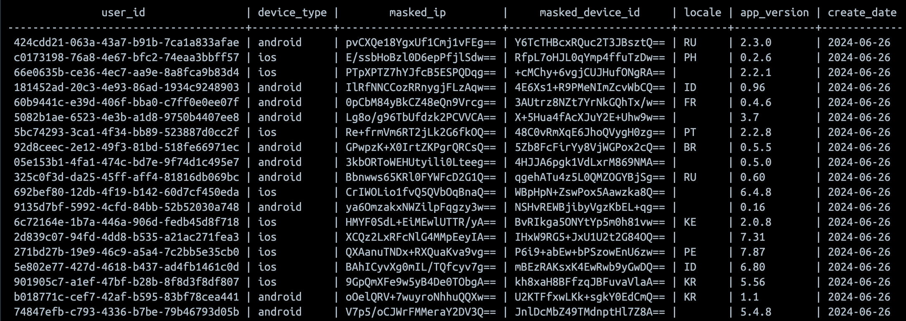
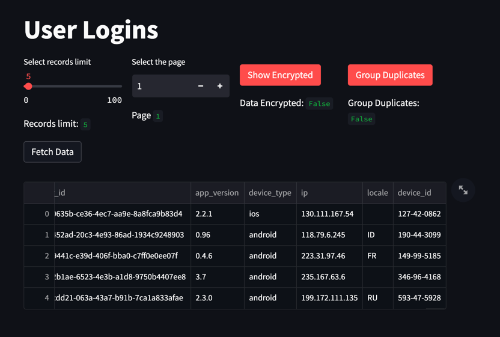

# Project: dataops-takehome

## How to run
```
1. Install docker on the desktop - https://docs.docker.com/compose/install/
2. Check for docker & docker-compose version -  `docker --version`, `docker-compose --version`
3. Clone the project - `git clone git@github.com:shivasaicharanruthala/dataops-takehome-2.git`
4. Go project directory - `cd dataops-takehome-2`
5. Run the docker-compose file - `docker-compose up -d`
6. Check the logs of application container 
  - check for active logs: `docker ps`
  - check for container id of the image: `docker ps --filter "ancestor=shiva5128/dataops-takehome-2:latest"`
  - check for logs: `docker logs <container-id>`
7. Check the data in postgres
  - Conenct to postgres: `psql -d postgres -U postgres -p 5432 -h localhost -W`
  - Use `postgres` as password when prompted in terminal
  - check the records: `select * from user_logins;`
```


## Decisions and Assumptions made during this assignment
1. How will you read messages from the queue?
   - **Where is SQS:** The SQS service can be spinned up locally using localstack and docker image used is `fetchdocker/data-takehome-localstack`
   ``` 
     # docker-compose.yml
   
    services:
    localstack:
    image: fetchdocker/data-takehome-localstack
    ports:
      - "4566:4566"
   ```
   - **Communicating with SQS:** In our setup, we're evaluating two message consumption strategies, push and pull mechanisms. The push method involves using a lambda trigger on SQS, allowing instantaneous processing of published messages. This approach is ideal for real-time streaming scenarios. However, due to our lack of control over the SQS service, we are unable to leverage this push mechanism. Therefore, we opt for the pull mechanism, employing adaptive polling for optimized performance. In this approach, our system retrieves messages from SQS periodically rather than immediately upon publication. We assume processing events from SQS in batches is acceptable for our use case, ensuring efficient handling of incoming data.
   - For simplicity and time efficiency, we've opted to interact with the SQS Queue using CuRL/HTTP methods instead of relying on a specific SQS client library or SDK in Golang. One notable advantage of this approach is its resilience against updates or deprecated methods in client libraries, as we remain independent of such changes. This ensures our integration with SQS remains robust and minimizes the need for frequent code updates.
   - We need to configure the client to connect to the localstack endpoint where SQS is running.
   - Messages will be retrieved from the queue using a polling mechanism.
   ```go
	 ///  extractor.go
   
    // FetchDataFromSQS fetches data from the SQS endpoint, processes the response, and returns a model.Response.
    func (ex *extractor) FetchDataFromSQS() ([]model.Response, error) {
        // Create a new GET request to the SQS endpoint.
        req, err := http.NewRequest("GET", ex.SqsEndpoint, nil)
        if err != nil {
        lm := log.Message{Level: "ERROR", ErrorMessage: fmt.Sprintf("Error creating request to sqs enpoint: %v", err.Error())}
        ex.logger.Log(&lm)
    
            return nil, err
        }
    
        // Send the request and receive the response.
        resp, err := http.DefaultClient.Do(req)
        if err != nil {
            lm := log.Message{Level: "ERROR", ErrorMessage: fmt.Sprintf("Error sending request to sqs enpoint: %v", err.Error())}
            ex.logger.Log(&lm)
    
            return nil, err
        }
    
        defer resp.Body.Close()
        ......
        ......
    }
   ```
   
2. What type of data structures should be used?
   - **Data from SQS:**  Http response from SQS endpoint returns as XML format and body attribute is in JSON.
   ```xml
      <?xml version='1.0' encoding='utf-8'?>
      <ReceiveMessageResponse xmlns="http://queue.amazonaws.com/doc/2012-11-05/">
         <ReceiveMessageResult>
            <Message>
               <MessageId>11805423-7b47-4e24-aff2-689be37aed55</MessageId>
               <ReceiptHandle>NDFmZThhOTgtNDZlZC00ZDlmLTk4ZjAtOWQ4YzA5ZDlmMDY4IGFybjphd3M6c3FzOnVzLWVhc3QtMTowMDAwMDAwMDAwMDA6bG9naW4tcXVldWUgMTE4MDU0MjMtN2I0Ny00ZTI0LWFmZjItNjg5YmUzN2FlZDU1IDE3MTc4OTUyMjIuOTMwMzc0Ng==</ReceiptHandle>
               <MD5OfBody>e4f1de8c099c0acd7cb05ba9e790ac02</MD5OfBody>
               <Body>{&quot;user_id&quot;: &quot;424cdd21-063a-43a7-b91b-7ca1a833afae&quot;, &quot;app_version&quot;: &quot;2.3.0&quot;, &quot;device_type&quot;: &quot;android&quot;, &quot;ip&quot;: &quot;199.172.111.135&quot;, &quot;locale&quot;: &quot;RU&quot;, &quot;device_id&quot;: &quot;593-47-5928&quot;}</Body>
            </Message>
            <Message>
               <MessageId>11805423-7b47-4e24-aff2-689be37aed55</MessageId>
               <ReceiptHandle>NDFmZThhOTgtNDZlZC00ZDlmLTk4ZjAtOWQ4YzA5ZDlmMDY4IGFybjphd3M6c3FzOnVzLWVhc3QtMTowMDAwMDAwMDAwMDA6bG9naW4tcXVldWUgMTE4MDU0MjMtN2I0Ny00ZTI0LWFmZjItNjg5YmUzN2FlZDU1IDE3MTc4OTUyMjIuOTMwMzc0Ng==</ReceiptHandle>
               <MD5OfBody>e4f1de8c099c0acd7cb05ba9e790ac02</MD5OfBody>
               <Body>{&quot;user_id&quot;: &quot;424cdd21-063a-43a7-b91b-7ca1a833afae&quot;, &quot;app_version&quot;: &quot;2.3.0&quot;, &quot;device_type&quot;: &quot;android&quot;, &quot;ip&quot;: &quot;199.172.111.135&quot;, &quot;locale&quot;: &quot;RU&quot;, &quot;device_id&quot;: &quot;593-47-5928&quot;}</Body>
            </Message>
         </ReceiveMessageResult>
         <ResponseMetadata>
            <RequestId>21Q6H7RGNPRLMLLXJBQZP8CB2P3VEQS49I9M1BAS39GMLT341IPF</RequestId>
         </ResponseMetadata>
      </ReceiveMessageResponse>
   ```
   - **Usage of these fields in code**: We need to define custom data structures in our code to represent the flattened and masked data before writing it to the database.
   ```go
       / // model/message.go
      
      type Response struct {
         RequestId     string `json:"-"`
         MessageId     string `json:"-"`
         ReceiptHandle string `json:"-"`
         MD5OfBody     string `json:"-"`
         UserID        string `json:"user_id"`
         AppVersion    string `json:"app_version"`
         DeviceType    string `json:"device_type"`
         IP            string `json:"ip"`
         Locale        string `json:"locale"`
         DeviceID      string `json:"device_id"`
      }
   ```

3. How will you mask the PII data so that duplicate values can be identified?
   - **Choice of masking PII data:** while there are handful of way we can mask the PII data like `Encryption and Decryption, Hasing, Tokenization, Masking, Anonymization` but for our use case reversibility of data whenever required is the main concern so I choose to go with `encryption & decryption` as this provides `Reversibility, selective access(reversible only by secret key used for encryption), Data Confidentiality, Format Preserving Encryption`
   - **Preserving duplicates while masking:** Here most important is deterministic encryption scheme using AES algorithm where the same plaintext string will always be encrypted to the same ciphertext, regardless of any external factors such as the encryption key.
   ```go
      // model/message.go
      
      // MaskBody encrypts the DeviceID and IP fields of the Response struct if they are not empty.
   func (res *Response) MaskBody() error {
      if res.DeviceID != "" {
         encryptedDeviceId, err := encrypt(res.DeviceID)
         if err != nil {
            return err
         }

         res.DeviceID = *encryptedDeviceId
      }

      if res.IP != "" {
           encryptedIP, err := encrypt(res.IP)
           if err != nil {
               return err
           }
   
           res.IP = *encryptedIP
     }

      return nil
   }       
   ```
4. What will be your strategy for connecting and writing to Postgres?
   - Running container instance of postgres database with existing table named `user_login`.
   - Used a PostgreSQL client library `github.com/lib/pq v1.10.9` to communicate/connect application with database.
   - Insertion of data can be done sequentially but batch inserts performs better when compared to sequential inserts.
     - Reduced Overhead: When performing a batch insert, there's less overhead compared to executing multiple individual insert statements. Overhead is due network round trips, parsing SQL statements, and establishing connections to the database server
     - Enhanced Database Buffering: Database systems often optimize batch inserts by buffering the inserted data in memory before committing it to disk. This batching of data can significantly reduce the number of disk I/O operations, which tend to be slower compared to operations performed in memory.
   ```go
      // BatchInsert inserts a batch of responses into the PostgreSQL database.
       func (l *loader) BatchInsert(responses []*model.Response) error {
         // Initialize slices to build the SQL statement
         valueStrings := make([]string, 0, len(responses))     // Slice to hold value placeholders
         valueArgs := make([]interface{}, 0, len(responses)*6) // Slice to hold the actual values
      
          // Iterate over the responses and construct the values part of the SQL statement
          for i, response := range responses {
              valueStrings = append(valueStrings, fmt.Sprintf("($%d, $%d, $%d, $%d, $%d, $%d, NOW() AT TIME ZONE 'UTC')", i*6+1, i*6+2, i*6+3, i*6+4, i*6+5, i*6+6))
              valueArgs = append(valueArgs, response.UserID, response.DeviceType, response.IP, response.DeviceID, response.Locale, response.AppVersion)
          }
      
          // Join the value strings to form the complete SQL statement
          stmt := fmt.Sprintf("INSERT INTO user_logins (user_id, device_type, masked_ip, masked_device_id, locale, app_version, create_date) VALUES %s",strings.Join(valueStrings, ","))
      
          // Execute the SQL statement with the value arguments
          _, err := l.dbConn.Exec(stmt, valueArgs...)
          if err != nil {
              lm := log.Message{Level: "ERROR", ErrorMessage: fmt.Sprintf("Failed to execute batch insert with error : %v", err.Error())}
              l.logger.Log(&lm)
      
              return err
          }

          lm := log.Message{Level: "INFO", Msg: fmt.Sprintf("Successfully inserted a batch to database.")}
		  l.logger.Log(&lm)

		  return nil
       }
   ```
5. Where and how will your application run?
   - Since the task is minimal, used Docker to run all components locally, we'll create Docker containers for our application, localstack (for SQS), and PostgreSQL. 
   - Docker Compose is used to define and manage the containers configurations and dependencies with health checks.  
   - The application is packaged into a Docker image and run as a container alongside localstack and PostgreSQL containers. 
   - We'll need to ensure that our application container can communicate with both localstack and PostgreSQL containers within the Docker network.

## How would you deploy this application in production?
1. What other components would you want to add to make this production ready?
   - Managed Services: 
     - use managed postgres database with init.sql script that creates `user_login` table before the service is available.
     - instead of localstack, aws managed SQS can be used for better availability and system resilience.
     - managed artifact registry in case for private registry or still we can use docker hub for public images
     - keyvault service for storing secrets.
   - Cloud deployment: 
     - Use a cloud provider like AWS, Azure, or GCP for deployment.
     - Use IaaS like terraform to create stable infrastructure.
   - CI/CD pipelines:
     - Set up a CI/CD pipeline using tools like Jenkins, GitHub Actions, or GitLab CI to automate the build, test, and deployment process. here I have used github actions.
     - Ensure automated tests are run before deployment to catch any issues early.
   - Monitoring and Logging:
     - Implement monitoring using tools like Prometheus and Grafana.
     - Set up centralized logging using tools like ELK Stack (Elasticsearch, Logstash, Kibana) or AWS CloudWatch. I choose to go with Cloud watch from AWS provider as integrating is much simpler.
   
2. How can this application scale with a growing dataset.
   - Vertical scaling: can increase cpu, memory to handle more traffic but there is a limitation on hardware that can be upgraded to.
   - Horizontal Scaling: Deploy multiple instances of the application container to handle increased load. Mutiple intances can extract more messages parallely.
   - Tweak config variables like `MAX_MESSAGES`, `MAX_WAIT_TIME` to extract more messages at once.
    
3. How can PII be recovered later on?
   - Encryption & Decryption with Key Management:
     - Encrypt the device_id and ip fields using a reversible encryption algorithm/deterministic encryption scheme using AES algorithm and store the encryption keys securely using a key management service like AWS KMS. 
     - Ensure the keys are accessible only to authorized users with strict access controls.
   - Hashing with Salt:
      - Use a consistent hashing algorithm with a secret salt for masking. 
      - Store the salt securely so that the original values can be recovered by authorized users.
   
4. What are the assumptions you made?
    - **Airflow vs Custom build ETL pipelines:** Airflow is useful for complex depend task, requires scheduling, better user interface provides manual retry mechanism, tools for monitoring different process but this is not as fast as Custom ETL build logic. this can be helpful when extracting data from various data sources in a batch wise manner. These are memory extensive for a small scale ETL pipelines with performance overhead.
    - **Which programming language to choose:** I have choose to develop in golang for following reasons
       - Need high-performance, low-latency ETL processes.
       - Granular control over your ETL logic and can manage concurrency effectively.
       - Though this process requires to more effort to set up the project and develop. Need to work around with 3rd tools integration for monitoring, logging, metrics.
    - **Extraction of messages:** 
      - **Adaptive Polling Strategy:** 
        - Added a MAX_NO_RESPONSES configuration variable to handle cases where SQS may not have any messages. If the application receives consecutive empty responses, it incrementally increases the wait time between polls, reducing unnecessary resource utilization.
        - Introduced the MAX_CONSECUTIVE_NO_RESPONSES configuration variable. Once the system reaches this threshold of consecutive empty responses, it gracefully shuts down. This prevents continuous polling when no messages are available, optimizing resource usage. Note that any messages generated in SQS after this point will not be consumed until the system is restarted.
      - **Handling Partial Batch Scenarios:** Addressed the scenario where some workers consume messages while others do not, resulting in fewer messages than BATCH_SIZE. Ensured that these remaining records are still processed and inserted into the database efficiently, even if the batch is not fully populated.

5. Future work/Optimization
   - we can leverage multiple go routines along with worker pools to synchronize between all the go routines in extracting messages from SQS and insert in a batch wise to postgres.

## Running Application:  Screens & Logs
- Running Application using docker-compose

- Screenshot of images running in docker

- Logs from running application
``` 
2024-06-25 23:06:16 Error loading .env file
2024-06-25 23:06:16 2024/06/26 03:06:16 INFO: {"level":"INFO","msg":"Logger initialized successfully"}
2024-06-25 23:06:16 2024/06/26 03:06:16 INFO: {"level":"INFO","msg":"Database initilized sucessfully."}
2024-06-25 23:06:16 2024/06/26 03:06:16 INFO: {"level":"INFO","msg":"Successfully inserted a batch to database."}
2024-06-25 23:06:17 2024/06/26 03:06:17 INFO: {"level":"INFO","msg":"Successfully inserted a batch to database."}
2024-06-25 23:06:17 2024/06/26 03:06:17 INFO: {"level":"INFO","msg":"Successfully inserted a batch to database."}
2024-06-25 23:06:17 2024/06/26 03:06:17 INFO: {"level":"INFO","msg":"Successfully inserted a batch to database."}
2024-06-25 23:06:20 2024/06/26 03:06:20 INFO: {"level":"INFO","msg":"Received empty response"}
2024-06-25 23:06:23 2024/06/26 03:06:23 INFO: {"level":"INFO","msg":"Received empty response"}
2024-06-25 23:06:26 2024/06/26 03:06:26 INFO: {"level":"INFO","msg":"Received empty response"}
2024-06-25 23:06:29 2024/06/26 03:06:29 INFO: {"level":"INFO","msg":"Received empty response"}
2024-06-25 23:06:32 2024/06/26 03:06:32 INFO: {"level":"INFO","msg":"Received empty response"}
2024-06-25 23:06:32 2024/06/26 03:06:32 INFO: {"level":"INFO","msg":"Waiting for 1s due to consecutive empty responses"}
2024-06-25 23:06:36 2024/06/26 03:06:36 INFO: {"level":"INFO","msg":"Received empty response"}
2024-06-25 23:06:36 2024/06/26 03:06:36 INFO: {"level":"INFO","msg":"Waiting for 2s due to consecutive empty responses"}
2024-06-25 23:06:41 2024/06/26 03:06:41 INFO: {"level":"INFO","msg":"Received empty response"}
2024-06-25 23:06:41 2024/06/26 03:06:41 INFO: {"level":"INFO","msg":"Waiting for 3s due to consecutive empty responses"}
2024-06-25 23:06:47 2024/06/26 03:06:47 INFO: {"level":"INFO","msg":"Successfully inserted a batch to database."}
2024-06-25 23:06:47 2024/06/26 03:06:47 INFO: {"level":"INFO","msg":"Successfully inserted a batch to database."}
2024-06-25 23:06:47 2024/06/26 03:06:47 INFO: {"level":"INFO","msg":"Successfully inserted a batch to database."}
2024-06-25 23:06:47 2024/06/26 03:06:47 INFO: {"level":"INFO","msg":"Successfully inserted a batch to database."}
```
- Data stored in postgres (ip, device_id is masked)


- Masked data can be decrypted back to original text

